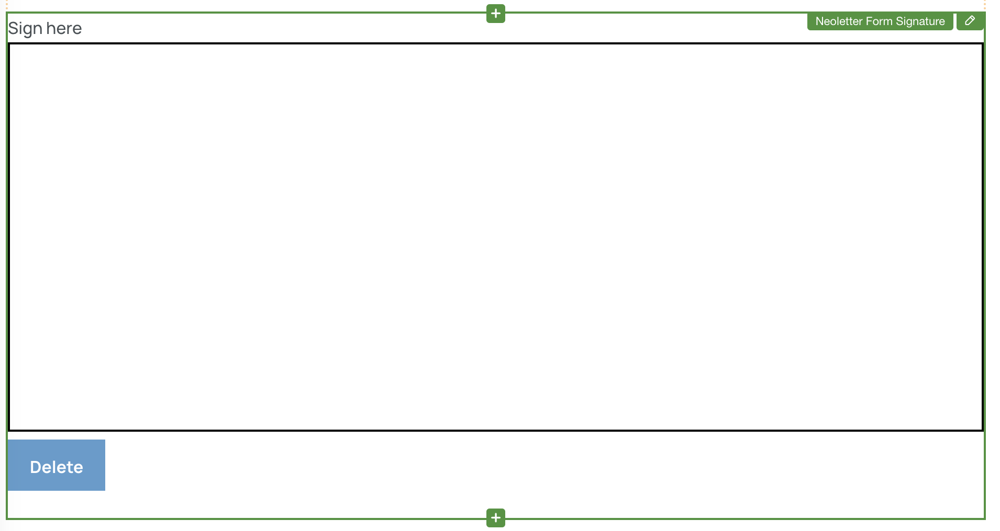
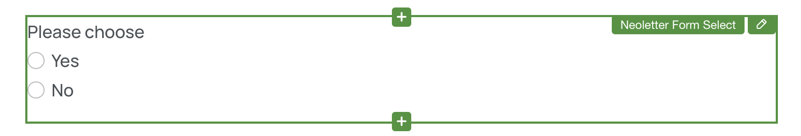

# Scrivito Neoletter Form Widgets

A set of Scrivito Widgets for building awesome forms

**[Neoletter](https://www.neoletter.com)** | **[Scrivito](https://www.scrivito.com)**

## Minimum Required Scrivito Version

To use this package, you must have Scrivito version 1.30.0 or later installed in your project.

# Features

- Single-step & multiple-step forms
- Dropdowns
- Single-select radio buttons
- Multi-select checkboxes
- Rating controls
- Date & date-time controls
- Conditionals
- Signature
- Captcha support

## Installation


> ⚠️ **Legacy Form Support Removed**
>
> Starting from **version `0.0.32`**, support for legacy forms has been **completely removed**.  
> If your project still uses legacy forms, **do not update** to this version.  
> We recommend migrating to the new form system before upgrading.

Install the package into your scrivito app:

```shell
npm install scrivito-neoletter-form-widgets
```

## Importing and Initializing

Import the `initNeoletterFormWidgets` function from the package and call it in your index.js file found in the Widgets folder (e.g., in `src/Widgets/index.js`). If you are using Scrivito version 1.39.0 or later, you do not need to pass your Scrivito tenant ID to the function. However, if you are using a Scrivito version prior to 1.39.0, you must provide your tenant ID as an argument.

```js
import { initNeoletterFormWidgets } from "scrivito-neoletter-form-widgets";

// If using Scrivito version 1.39.0 or later
initNeoletterFormWidgets();

// If using Scrivito version prior to 1.39.0
// initNeoletterFormWidgets({ instanceId: process.env.SCRIVITO_TENANT });
```

Import the `loadEditingConfigs` function from the package and call it in your editingConfigs.js file also found in the Widgets folder.

```js
import { loadEditingConfigs } from "scrivito-neoletter-form-widgets/editing";

loadEditingConfigs();
```

Add the widget styles to your app.
This can be done by either loading the CSS via `css-loader` (e.g. in `src/index.js` or `src/Widgets/index.js`):

```js
import "scrivito-neoletter-form-widgets/index.css";
```

Or by importing the styles into your stylesheets (e.g. in `src/assets/stylesheets/index.scss`):

```scss
@import "scrivito-neoletter-form-widgets/index.css";
```

Add the editing styles in `scrivitoExtensions.scss`:

```scss
@import "scrivito-neoletter-form-widgets/editing.css";
```

If your project does not include the `scrivito-icon-editor` package, you will need to manually include the styles for icons and editor support:

```scss
@import 'bootstrap-icons/font/bootstrap-icons.css';
@import 'scrivito-icon-editor/ScrivitoIconEditor.css';
```

Delete all form widgets included in the Example App from the "Widgets" folder:

- FormButtonWidget
- FormCheckboxWidget
- FormContainerWidget
- FormHiddenFieldWidget
- FormInputFieldWidget

You're done! Enjoy building well-designed and cleverly arranged forms!

## Prerendering with Vite

When using prerender in a Vite environment, you need to add `--options.deps.external='/scrivito/'` to the script in order to create static HTML files correctly. Example:

```json
"prerender": "npm run build && vite-node --options.deps.external='/scrivito/' src/prerender_content.js"
```

**Note:** Prerender with active captchas will not render the captchas. This is because both captchas make use of the `window` object in their scripts, and the `window` object is not available when running `vite-node`.

# Neoletter Form Widgets Overview


The following widgets are typically added within the [Form](#form-widget) widget to create well-structured forms:

- [Form Step](#form-step-widget): Configures an individual step within the form.
- [Form Checkbox](#form-checkbox-widget): Adds checkbox input fields.
- [Form Date](#form-date-widget): Includes date and date-time input fields.
- [Form Input Field](#form-input-field-widget): Adds customizable input fields.
- [Form Rating](#form-rating-widget): Integrates a rating control.
- [Form Signature](#form-signature-widget): Integrates a signature.
- [Form Select](#form-select-widget): Provides single or multiple selection options, including radio buttons, dropdowns, and checkboxes.
- [Hidden Form Field](#form-hidden-field-widget): Adds hidden form fields.
- [Form Conditional Container](#form-conditional-container-widget): Allows you to conditionally show/hide other widgets based on user selections.
- [Form Condition](#form-condition-widget): Defines a condition for showing or hiding other widgets within the [Form Conditional Container](#form-conditional-container-widget) widget.

Of course, you can also add any additional non-form widgets.

# Form Widgets

## Form Widget


The `Form` widget is the main widget for creating and managing forms. To add various form elements and controls, you need to place them inside the `Form` widget.

### Properties


The `Form` widget has the following properties divided into several tabs:

- "General" tab
  - Show frame: Adds a frame around the form.
  - Additional CSS Classes: Specify additional CSS class names to be added to the main container of the form. Separate multiple class names with spaces.
  - Buttons size: Select the size of all buttons (footer, retry, delete signature).
  - Enable fixed height: Manually set the form height if enabled.
  - Form height: Enter the height of the form content measured in em units.
  - Scrollbar width: Select the width of the scrollbar. "None" will hide the scrolbar.
  - Overscroll behavior: Select how overscrolling should behave, i.e. it scrolls also the container."
- "Google reCAPTCHA V2" Tab (Tab visible if captchaType is set to `google-recaptcha-v2`)
  - Enable captcha: Enables Google reCAPTCHA v2 for the current form. You need to [Setup reCAPTCHA](#google-recaptcha-developer-setup) first.
  - Language: Select the language for the reCAPTCHA. Google reCAPTCHA automatically adapts to the browser`s language setting, this property is optional and must not be filled. Refer to the language section [here](https://developers.google.com/recaptcha/docs/language) for setting the language manually.
  - Theme: Choose between light and dark theme. You will need to refresh the page in order to reflect the changes or you can simply re-enable the captcha again.
  - Alignment: Alignment for the reCAPTCHA.
- "Friendly Captcha" Tab (Tab visible if captchaType is set to `friendly-captcha`)
  - Enable captcha: Enables Friendly Captcha for the current form. You need to [Setup Friendly Captcha](#friendly-captcha-setup) first.
  - Language: Select the language for the Friendly Captcha. Refer to the language section [here](https://docs.friendlycaptcha.com/#/widget_api?id=data-lang-attribute) to see the available language codes.
  - Start verification: Choose when the verification should start.
  - Theme: Choose between light and dark theme.
  - Alignment: Alignment for the Friendly Captcha.
- "Steps" tab (Tab visible if form has "Multiple Steps")
  - Steps: Configure the form steps.
- "Review" tab (Tab visible if form has "Multiple Steps", content depends on review selection)
  - Enable Review: Adds a button to the last step of "Multiple Steps" for reviewing the answers.
  - Review button text: The text for the review button.
  - Show steps: Shows the steps in the review dialog.
  - Include empty answers: Includes empty answers in the review dialog, otherwise only non empty answers are shown.
  - Show header: Adds a header to the review dialog.
  - Header title: The title of the review header.
  - Show footer: Adds a footer with a button for closing the review dialog.
  - Close button text: The text on the button for closing the review dialog.
- "Hidden fields" tab
  - Hidden Fields: Customize hidden fields.
- "Form submission" tab
  - Form ID: This ID identifies the form in Neoletter. The input field includes icons to generate a new ID and to restore the initial ID that was stored before opening the properties.
- "Submission messages" tab
  - Submitting message type: Select the type of message displayed while the form is being submitted.
  - Submitting message: Message shown while the form is being submitted. (Visible if submitting message type is set to `Default text`).
  - Submitting content: Widgets shown while the form is being submitted. (Visible if submitting message type is set to `Custom content`).
  - Preview submitting message/widgets: Preview the message or content displayed while the form is being submitted. Works only in edit mode.
  - Submission success message type: Select the type of message displayed after successful form submission.
  - Submitted message: Message shown after the form was successfully submitted. (Visible if submission success message type is set to `Default text`).
  - Submission success content: Widgets shown after the form was successfully submitted. (Visible if submission success message type is set to `Custom content`).
  - Preview success message/widgets: Preview the message or content displayed after the form was successfully submitted. Works only in edit mode.
  - Submission failure message type: Select the type of failure message displayed upon submission failure.
  - Failed message: Message shown if the form submission failed. (Visible if submission failure message type is set to `Default text`).
  - Submission failure content: Widgets shown if the form submission failed. (Visible if submission failure message type is set to `Custom content`).
  - Show retry button: Show a retry button at the end of the message/widgets.
  - Retry button text: The text for the retry button.
  - Retry button alignment: Alignment for the retry button.
  - Preview failed message/widgets: Preview the message or content displayed if the form submission failed. Works only in edit mode.
- "Navigation area" tab (Content depends on form type i.e. single-step or multiple-steps)
  - Forward button text: Text for the forward button.
  - Backward button text: Text for the backward button.
  - Submit button text: Text for the submit button.
  - Alignment: Alignment for the single-step form submit button.

### Validation

The `Form` Widget has specific validation requirements:

- The widget cannot be placed into another Form widget.
- The form ID must be a 32-character hexadecimal value.

## Form Step Widget


The `Form Step` widget represents an individual step within the form. Each step can have its own set of form elements, controls, and content.

### Properties

- Items: Configure the items or content for this step.

### Validation

- The step widget must be placed within the form.
- Each step must include at least one item.

## Form Checkbox Widget


The `Form Checkbox` widget lets you add individual single checkbox input fields to your form. You can specify whether the checkbox is mandatory and define its type, custom field name, and help text.

### Properties

- Input type: The checkbox type for accepting terms, a subscription, or a custom option.
- Field name: Define the field name for the checkbox.
- Label: Provide a descriptive label for the checkbox to convey its purpose.
- Alignment: Aligns the widget.
- Mandatory: Indicates whether the checkbox is required.
- Validation Message: The text displayed when the input is invalid.
- Help text: Provide optional help text for the checkbox.

### Validation

- This checkbox widget must be placed within a Form widget to be effective.
- The field name must be unique and start with `custom_`, if the selected input type is `custom`.

## Form Date Widget


The `Form Date` widget allows users to input dates in various formats. You can customize the label, date format, field name, and specify whether the date input is mandatory.

### Properties

- Label: Set the label for the date input field.
- Alignment: Aligns the widget.
- Format: Choose between date-only and date-and-time formats.
- Field name: Define the field name for the date input.
- Mandatory: Indicates whether the date input is required.
- Validation Message: The text displayed when the input is invalid.
- Help text: Provide optional help text for the date input.

### Validation

- This date input widget must be placed within a Form widget to be effective.
- The field name must be unique and start with `custom_`.

## Form Input Field Widget


The `Form Input Field` widget adds customizable input fields to your form. You can define the following properties: label, placeholder, input type, custom type, custom field name, and help text.

### Properties

- Input type: Select the type of input, such as name, email, phone number, or custom.
- Auto-fill with logged-in user details: Automatically populates the field with the logged-in user’s details. This feature is available only on restricted pages (pages that require user login). This option is shown only when the Input type is set to Email or Name.
- Custom input type: Specify custom input types, single-line or multi-line.
- Field name: Define the field name for the input.
- Label: Provide a descriptive label for the input field to convey its purpose.
- Placeholder: Define a placeholder text for the input field, providing guidance to users.
- Enable floating label: Places the label inside the input. Remove the placeholder when enabled.
- Mandatory: Indicates whether the input field is required.
- Validation Message: The text displayed when the input is invalid.
- Help text: Provide optional help text for the input field.

### Validation

- This input field widget must be placed within a Form widget to be effective.
- The field name must be unique and start with `custom_`, if the selected input type is `custom`.
- The Auto-fill with logged-in user details option is only enabled on restricted pages.

## Form Rating Widget


The `Form Rating` widget integrates a rating control into your form, allowing users to provide ratings for a particular item or experience.

### Properties

The `Form Rating` widget has the following properties divided into several tabs:

- "General" tab
  - Label: Set the label for the rating control.
  - Alignment: Aligns the widget.
  - Field name: Define the field name for the rating.
  - Help text: Provide optional help text for the rating control.
- "Stylings" tab
  - Hover effect: Previews icon selection on hover.
  - Size: Choose the size of the icon.
  - Color: Choose the color for selected icons i.e. Default, Primary, Secondary and Custom .
  - Custom Hex Color: Specify a custom hex color.
- "Icon" tab:
  - Allows changing the icon for the rating control.

### Validation

- This rating widget must be placed within a Form widget to be effective.
- The field name must be unique and start with `custom_`.
- Custom hex color must be a valid hexadecimal color if the color type is set to `Custom`.

### Note

The colors for "Primary" and "Secondary" are retrieved from Bootstrap variables `--bs-primary` and `--bs-secondary`, respectively. If these Bootstrap variables are not found, the widget will fallback to using `#f03a47` (for "Secondary") and `#5c9dcd` (for "Primary") as default colors. The CSS representation for these defaults is: `var(--bs-secondary, #f03a47)` and `var(--bs-primary, #5c9dcd)`.

## Form Signature Widget



The `Form Signature` widget allows users to draw a signature on the form. This widget is useful for forms that require a digital signature.

### Properties

- Title: Set the title for the signature widget.
- Alignment: Aligns the widget.
- Help text: Provide optional help text for the signature.
- Field name: Define the field name for the signature.
- Stroke color: Choose the color of the signature stroke.
- Stroke thickness: Define the thickness of the signature stroke.
- Background color: Set the background color of the signature area.
- Delete button text: Specify the text for the delete button that allows users to clear their signature.
- Delete button alignment: Alignment of the delete button.

### Validation

- The widget must be placed within a Form widget to be effective.
- The field name must be unique and start with `custom_`.

## Form Select Widget



The `Form Select` widget enables you to create single or multiple selection elements, including radio buttons, dropdowns, or checkboxes in your form.

### Properties

- Input type: Choose the type of input, which can be single select (radio buttons, linear-scale or dropdown) or multi-select (checkboxes).
- Label: Specify the label for the select input.
- Alignment: Aligns the widget. Enabled if “Arrange items horizontally” is enabled for radio buttons or “Enable floating label” is disabled for dropdowns.
- Items: Configure the items or options available for selection. (Not visible for input type linear-scale.)
- Field name: Define the field name for the select input.
- Enable floating label: Places the label inside the dropdown. (Visible for dropdown only.)
- Navigate on click: Automatically navigate to the next step when an item is clicked. (Visible for radios only.)
- Mandatory: Indicates whether selection is required for single select inputs (radio buttons, linear-scale and dropdowns).
- Validation Message: The text displayed when the input is invalid.
- Help text: Provide optional help text for the select input.
- Arrange items horizontally: When enabled, all items will be displayed in a single row. (Visible for checkboxes & radios only.)
- Show clear selection button. (Visible for radios & linear-scale if mandatory is set to false.)
- Clear selection text: Allows the user to change the text of the button to clear the selection. (Visible if Show clear selection button is set to true.)
- Lower scale limit: Choose the lower limit, which can be either 0 or 1. (Visible for linear-scale only.)
- Upper scale limit: Choose the upper limit, which can be from 2 to 10. (Visible for linear-scale only.)
- Optional label for lower scale limit: Add text at the beginning of the linear scale. (Visible for linear-scale only.)
- Optional label for upper scale limit: Set text at the end of the scale. (Visible for linear-scale only.)

### Validation

- This select widget must be placed within a Form widget to be effective.
- The field name must be unique and start with `custom_`.

## Form Hidden Field Widget


The `Form Hidden Field` widget includes hidden form fields. These fields are typically used to store information that is sent on every submission of the form.

### Properties

- Input type:
  - Custom: Allows the creation of a custom hidden field.
  - Subscription: Activates the subscription process on every form submission. If this type is selected, the hidden value needs to be set to "on" to trigger the subscription process.
  - Email: Automatically populates the field with the logged-in user’s email. This feature is available only on restricted pages (pages that require user login).
  - Name: Automatically populates the field with the logged-in user’s name. This feature is available only on restricted pages (pages that require user login).
  - URL Parameter: Reads the value from the current page’s URL parameters and sends it with the form.
- Field name: Define the field name for the hidden field.
- Hidden value: Specify the hidden value for this field.
- URL Parameter Key: The name of the query parameter in the URL from which to read the value. For example, if the page URL is
`https://example.com/form?gid=abc123`, and the key is set to gid, then abc123 will be used as the field value.


### Validation

- This hidden field widget must be placed within a Form widget to be effective.
- For custom-type hidden fields, the field name must be unique and start with `custom_`.
- When utilizing the Subscription type, it's essential to set the hidden value to "on" to activate the subscription process during form submissions.
- When utilizing the Email or Name type, it's essential that the form is placed in a restricted page with a user login.

## Form Conditional Container Widget


The `Form Conditional Container` widget allows you to conditionally show or hide other widgets based on user selections. You can define conditions and provide content that appears based on the selected conditions. Furthermore, this widget enables you to create nested conditions by adding a Conditional Container widget within a Condition widget, allowing for intricate conditional logic.

### Properties

- Input type: Choose the input type for conditional selection including radio buttons or dropdowns.
- Label: Set the label for the conditional container.
- Alignment: Aligns the widget. Enabled only for radio buttons. Arrange items horizontally needs to be enabled. Not available for conditional dropdowns.
- Arrange items horizontally: When enabled, all items will be displayed in a single row. (Radio buttons only.)
- Conditions: Define conditions that determine which content is shown.
- Field name: Define the field name for the conditional container.
- Mandatory: Indicates whether the conditional container is required.
- Validation Message: The text displayed when the input is invalid.
- Help text: Provide optional help text for the conditional container.

### Validation

- This conditional container widget must be placed within a Form widget to be effective.
- The field name must be unique and start with `custom_`.

## Form Condition Widget

The `Form Condition` widget is used within the `Form Conditional Container` widget to define a single condition and specify the content to display when this condition is met.

### Properties

- Title: Set the title for the condition.
- Content: Configure the content to display when this condition is met. You can leave the content empty if you want no other widgets to be shown when this condition is met.

### Validation

- The Form Condition Widget can only be used inside the Form Conditional Container Widget.

# Review Feature

The Review feature allows users to review their answers before submitting a form with multiple steps. It provides a dialog where users can see all their responses at a glance.

### Review Dialog


### Closing the Dialog

Users can close the review dialog in two ways:

1. **Click Outside:** Clicking anywhere outside the dialog will close it.
2. **Close Button:** The dialog also includes a close button in the footer for users who prefer to close it manually.

It's important to note that the footer with the close button is not mandatory. Users can easily close the dialog using any of the methods mentioned above.

### Inclusion of Elements

By default, the Review feature checks and includes elements of types "input," "select," and "textarea" when displaying responses in the review. This means that only responses from these elements are shown in the review dialog, allowing users to verify their information.

Custom widgets with hidden inputs can also have their values displayed in the review when the "show-in-review" class is added to the hidden input.

The Review feature is specifically designed for forms with multiple steps, providing users with an opportunity to verify their responses before final submission.

# Custom Form Widgets

In addition to the built-in form widgets, you have the flexibility to use custom widgets, allowing you to enhance your forms with unique features and interactions. Custom form widgets can be used for various purposes, such as sliders, tri-state checkboxes, or any specialized input elements that you create as custom widgets and incorporate into your forms.

## Custom Form Widget Validation

When working with custom form widgets, it's important to ensure proper validation to maintain the integrity of your forms. The Scrivito Form Widgets package provides several useful functions for this purpose:

#### `insideFormContainerValidation`

- This function checks if the given widget is placed inside a form. It's crucial to confirm that your custom form widgets are correctly structured within a form container to maintain the expected behavior.

#### `getFormContainer`

- Use this function to find the first form container within your widget hierarchy. It returns the container widget, or `null` if no container is found.

#### `customFieldNameValidation`

- This function checks if the custom field attribute, which must be named "customFieldName," is unique within the widget hierarchy. To meet the requirements for custom field names, they must start with "custom\_" and be unique.

For custom widgets that use hidden inputs and want to show the hidden input values in the review, you should add the class "show-in-review" to the hidden input element. This class indicates that the hidden input's value should be displayed in the review.

**Note:** The review feature displays both the question and the answer for each input. To ensure that the question is displayed in the review, you should provide a "label" or "title" attribute within your custom widgets.

By following these guidelines and specifying these validation functions in your custom form widget edit configuration, you can create and integrate custom form widgets seamlessly into your forms, ensuring that they function as intended.

Custom form widgets offer endless possibilities for tailoring your forms to your specific needs, enhancing the user experience and interaction.

## Custom Form Widgets Example

To gain a better understanding of how custom form widgets can be used, let's explore an example. In this case, we'll create a custom slider widget that includes a hidden input, a label, and the "show-in-review" class to display the label and value in the review.

### Creating a Custom Slider Widget

1. Start by creating a new folder named "FormSliderWidget" inside the "Widgets" folder of your Scrivito App.

2. Inside the "FormSliderWidget" folder, create three files:

#### FormSliderWidgetClass.js

```js
import * as Scrivito from "scrivito";

export const FormSliderWidget = Scrivito.provideWidgetClass(
  "FormSliderWidget",
  {
    attributes: {
      label: "string",
      customFieldName: "string"
    }
  }
);
```

#### FormSliderWidgetComponent.js

````js
import * as React from "react";
import * as Scrivito from "scrivito";

/**
 * FormSliderWidget component for rendering a custom slider input in a form.
 *
 * @param {object} widget - The Scrivito widget object containing field attributes.
 * @param {function} onInputChange - Callback function to handle form input changes.
 *
 * The onInputChange callback must be triggered for any form input changes. It expects:
 *  - Field name (string)
 *  - Field value (string)
 *
 * Alternatively, you can pass a StringMap where the key is the field name and the value is the corresponding string value.
 *
 * Example:
 * ```js
 * // Using individual field name and value:
 * onInputChange("customFieldName", "42");
 *
 * // Using a StringMap:
 * onInputChange({
 *   "customFieldName1": "42",
 *   "customFieldName2": "88"
 * });
 * ```
 */
Scrivito.provideComponent("FormSliderWidget", ({ widget, onInputChange }) => {
  const fieldName = widget.get("customFieldName");
  const [value, setValue] = React.useState("50");

  const onChangeValue = (e) => {
    const newValue = e.currentTarget.value;
    setValue(newValue);

    // Triggering the onInputChange callback with the field name and value (as string)
    onInputChange(fieldName, newValue);
  };

  return (
    <div className="row mb-3">
      <span className="text-super">{widget.get("label")}</span>
      <input
        type="range"
        onChange={onChangeValue}
        min="0"
        max="100"
        value={value}
      />
      <input
        type="hidden"
        className="show-in-review"
        name={fieldName}
        value={value}
      />
    </div>
  );
});
````

#### FormSliderWidgetEditingConfig.js

```js
import * as Scrivito from "scrivito";
import {
  customFieldNameValidation,
  insideFormContainerValidation
} from "scrivito-neoletter-form-widgets/validations";

Scrivito.provideEditingConfig("FormSliderWidget", {
  title: "Form Slider",
  attributes: {
    label: { title: "Label" },
    customFieldName: { title: "Field name" }
  },
  properties: ["label", "customFieldName"],
  initialContent: {
    label: "Slide me",
    customFieldName: "custom_"
  },
  validations: [insideFormContainerValidation, customFieldNameValidation]
});
```

Please note that this example is intended to provide a basic demonstration of creating a custom form widget. It does not include styles or detailed CSS. You can further enhance the appearance and functionality of your custom widgets to match your specific design and usability requirements.

# Captcha Support

We currently support Google reCAPTCHA v3 (score based), v2 Checkbox challenge, and the GDPR-compliant Friendly Captcha with global endpoint (paid service). Follow [these](#google-recaptcha-developer-setup) steps to set up Google reCAPTCHA and [these](#friendly-captcha-setup) steps to setup Friendly Captcha for your site.


### Notes:
- You can only use one of them for your site, but you can change it later if needed.
- reCAPTCHA v3 is activated globally for all forms once configured. After a page with a form is rendered, the badge will appear and remain visible across all pages, as required by Google.
- If you want per-form activation, use reCAPTCHA v2 or Friendly Captcha instead.


## Google reCAPTCHA Developer Setup

1.  **Login to Google:** Sign in to your Google account or create one.
2.  **Go to the Google reCAPTCHA Admin Panel:** [Google reCAPTCHA Admin Panel](https://www.google.com/recaptcha/admin)
3.  **Create a New Site:** Click on the + button to create a new site.
4.  **Add Site Label:** Give your site a label.
5.  **Select reCAPTCHA Type:** In the reCAPTCHA type, either choose "Score based (v3)" or "Challenge (v2)" and select "I'm not a robot" Checkbox.
6.  **Add Your Domains:** Add the domains where you will be using the reCAPTCHA. You can add multiple domains.
7.  **Submit the Request:** Click on the "Submit" button. A site key and secret will be generated.
8.  **Use the siteKey:** Copy the site key and pass it in the initNeoletterFormWidgets function together with the `captchaType`, you will need to set the `captchaType` to `google-recaptcha` like below:

- Using Scrivito version prior to 1.39.0:

```js
import { initNeoletterFormWidgets } from "scrivito-neoletter-form-widgets";
initNeoletterFormWidgets({
  instanceId: process.env.SCRIVITO_TENANT,
  captchaOptions: {
    siteKey: "your_site_key",
    captchaType: "google-recaptcha-v3" // or "google-recaptcha-v2"
  }
});
```

- Using Scrivito version 1.39.0 or later:

```js
import { initNeoletterFormWidgets } from "scrivito-neoletter-form-widgets";
initNeoletterFormWidgets({
  captchaOptions: {
    siteKey: "your_site_key",
    captchaType: "google-recaptcha-v3" // or "google-recaptcha-v2"
  }
});
```

9. **Adjust Security Preferences:** Optionally, open the settings page in the admin panel and adjust the owners or the Security Preference.
10. **Configure the Content Security Policy (CSP):** Follow [these](#csp-configuration-for-captcha) instructions to configure the CSP.

Finally you need to setup the secret key in Neoletter to be able to use Google reCAPTCHA within your forms.

## Friendly Captcha Setup

1. **Login to Friendly Captcha:** Login in or create a new account on the [Friendly Captcha](https://friendlycaptcha.com/) site and follow the instructions from the site.
2. **Create a new Application:** After setup, go to the `Applications` tab and click on `Create new application` and enter the necessary details. Once you have completed this, take note of the sitekey value under the application name, we will need it later.
3. **Create a new API Key:** Go the the `API Keys` tab and create a new API key. Copy the key somewhere, it will be needed later for the Neoletter configuration.
4. **Use the siteKey:** Copy the site key and pass it in the initNeoletterFormWidgets function together with the `captchaType`, you will need to set the `captchaType` to `friendly-captcha` like below:

- Using Scrivito version prior to 1.39.0:

```js
import { initNeoletterFormWidgets } from "scrivito-neoletter-form-widgets";
initNeoletterFormWidgets({
  instanceId: process.env.SCRIVITO_TENANT,
  captchaOptions: {
    siteKey: "your_site_key",
    captchaType: "friendly-captcha"
  }
});
```

- Using Scrivito version 1.39.0 or later:

```js
import { initNeoletterFormWidgets } from "scrivito-neoletter-form-widgets";
initNeoletterFormWidgets({
  captchaOptions: {
    siteKey: "your_site_key",
    captchaType: "friendly-captcha"
  }
});
```

5. **Configure the Content Security Policy (CSP):** Follow [these](#csp-configuration-for-captcha) instructions to configure the CSP.

Finally you need to setup the API key in Neoletter to be able to use Friendly Captcha within your forms.

### CSP Configuration for captcha

The configuration of the CSP is identical regardless of whether you're using the Example App or the Portal App.

For the Example App, navigate to or open \_headersCsp.json located in the public folder.

For the Portal App, navigate to headers.config.ts located in the root of the project.

For the Google reCAPTCHA, add the following URLs to the "script-src" section:

```json
"https://www.google.com/recaptcha/",
"https://www.gstatic.com/recaptcha/"
```

For the Friendly Captcha, you need to add the following URLs to the "script-src" section:

```json
"blob:",
"'wasm-unsafe-eval'",
"https://cdn.jsdelivr.net/npm/"
```

For more information regarding CSP, please refer to the CSP section in the Friendly Captcha Docs found [here](https://docs.friendlycaptcha.com/#/csp) or in the Google reCAPTCHA FAQ found [here](https://developers.google.com/recaptcha/docs/faq?hl=de#im-using-content-security-policy-csp-on-my-website.-how-can-i-configure-it-to-work-with-recaptcha)

# Tracking

Enable the Beta Neoletter Tracking capabilities with:

```js
import { initNeoletterFormWidgets } from "scrivito-neoletter-form-widgets";
initNeoletterFormWidgets({
  tracking: true
});
```

# Local Development

To develop and test the package locally, follow these steps:

- Copy or clone the repository
- Navigate into the package directory.
- Install the package dependencies:

```shell
npm install
```

## Scrivito Portal App Development

For the Scrivito Portal App:

Link the package to your global `node_modules` folder:

```shell
npm run link:vite-project
```

Link the package into the Portal App with:

```shell
npm link scrivito-neoletter-form-widgets
```

Edit `index.ts` in the Widgets folder in the Portal App and add the following import:

```js
import { initNeoletterFormWidgets } from "scrivito-neoletter-form-widgets/src";
```

Below this import, call the `initNeoletterFormWidgets` function:

- Using Scrivito version prior to 1.39.0:

```js
initNeoletterFormWidgets({ instanceId: process.env.SCRIVITO_TENANT });
```

- Using Scrivito version 1.39.0 or later:

```js
initNeoletterFormWidgets();
```

Edit `editingConfigs.ts` in the Widgets folder in the Portal App and add the following:

```js
import { loadEditingConfigs } from "scrivito-neoletter-form-widgets/src/editing";

loadEditingConfigs();
```

**Note:**

The Scrivito Portal App is built using Vite and will automatically compile the package, so there's no need to run `npm run build` or `npm run start` for local development.

## Scrivito Example App Development

For the Scrivito Example App:

Build the package or run it in development mode:

```shell
npm run build
```

or

```shell
npm run start
```

Link the package to your global `node_modules` folder:

```shell
npm run link
```

Link the package into the Example App with:

```shell
npm link scrivito-neoletter-form-widgets
```

Edit `index.js` in the Widgets folder in the Example App and add the following import:

```js
import { initNeoletterFormWidgets } from "scrivito-neoletter-form-widgets";
```

Below this import, call the `initNeoletterFormWidgets` function:

- Using Scrivito version prior to 1.39.0:

```js
initNeoletterFormWidgets({ instanceId: process.env.SCRIVITO_TENANT });
```

- Using Scrivito version 1.39.0 or later:

```js
initNeoletterFormWidgets();
```

Edit `editingConfigs.js` in the Widgets folder and add the following:

```js
import { loadEditingConfigs } from "scrivito-neoletter-form-widgets/editing";

loadEditingConfigs();
```

Import the package styles into the `index.scss` file in the assets/stylesheets folder:

```scss
@import "scrivito-neoletter-form-widgets/index.css";
```

Import the editing styles into the `scrivitoExtensions.scss` file in the assets/stylesheets folder:

```scss
@import "scrivito-neoletter-form-widgets/editing.css";
```
