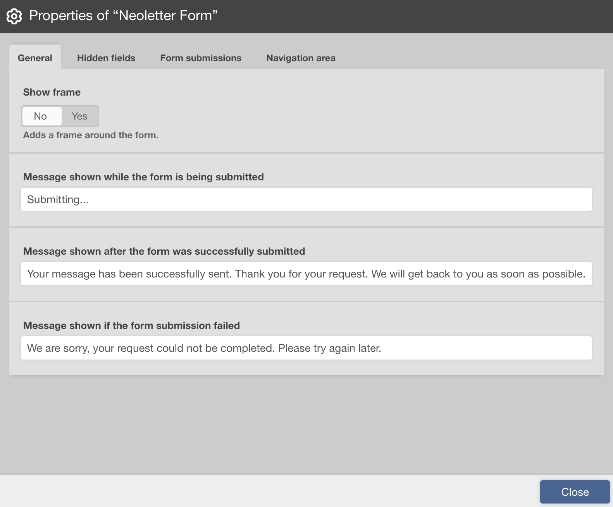
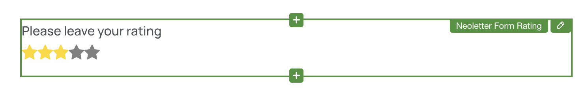

# Scrivito Neoletter Form Widgets

A set of Scrivito Widgets for building awesome forms

# Features
- Single-step & multiple-step forms
- Dropdowns
- Single-select radio buttons
- Multi-select checkboxes
- Rating controls
- Date & date-time controls
- Conditionals

## Installation

**Note:** If you have existing forms, they will run in legacy mode after installing this package. Legacy mode allows you to continue using your existing forms, but the new form features such as `review` or `steps` cannot be used by them. You can still add new widgets to existing forms.


Install the package into your scrivito app:

```shell
npm install scrivito-neoletter-form-widgets
```

Import the `initNeoletterFormWidgets` function from the package, and call it in your index.js file found in the Widgets folder (e.g. in `src/Widgets/index.js`), passing your Scrivito tenant ID to the function:
```js
import { initNeoletterFormWidgets } from 'scrivito-neoletter-form-widgets';

initNeoletterFormWidgets(process.env.SCRIVITO_TENANT);
```


Add the widget styles to your app. 
This can be done by either loading the CSS via `css-loader` (e.g. in `src/index.js` or `src/Widgets/index.js`):

```js
import 'scrivito-neoletter-form-widgets/index.css';
```

 Or by importing the styles into your stylesheets (e.g. in `src/assets/stylesheets/index.scss`):

```scss
@import 'scrivito-neoletter-form-widgets/index.css';
```

Delete all form widgets included in the Example App from the "Widgets" folder:
- FormButtonWidget
- FormCheckboxWidget
- FormContainerWidget
- FormHiddenFieldWidget
- FormInputFieldWidget

You're done! Enjoy building well-designed and cleverly arranged forms!

# Neoletter Form Widgets Overview


The following widgets are typically added within the [Form](#form-widget) widget to create well-structured forms:

- [Form Step](#form-step-widget): Configures an individual step within the form.
- [Form Checkbox](#form-checkbox-widget): Adds checkbox input fields.
- [Form Date](#form-date-widget): Includes date and date-time input fields.
- [Form Input Field](#form-input-field-widget): Adds customizable input fields.
- [Form Rating](#form-rating-widget): Integrates a rating control.
- [Form Select](#form-select-widget):  Provides single or multiple selection options, including radio buttons, dropdowns, and checkboxes.
- [Hidden Form Field](#form-hidden-field-widget): Adds hidden form fields.
- [Form Conditional Container](#form-conditional-container-widget): Allows you to conditionally show/hide other widgets based on user selections.
- [Form Condition](#form-condition-widget): Defines a condition for showing or hiding other widgets within the [Form Conditional Container](#form-conditional-container-widget) widget.

Of course, you can also add any additional non-form widgets.

# Form Widgets

## Form Widget


The `Form` widget is the main widget for creating and managing forms. To add various form elements and controls, you need to place them inside the `Form` widget. 

### Properties



The `Form` widget has the following properties divided into several tabs:

- "General" tab
    - Show frame: Adds a frame around the form.
    - Submitting message: Message shown while the form is being submitted.
    - Submitted message: Message shown after the form was successfully submitted.
    - Failed message: Message shown if the form submission failed.
- "Steps" tab (Tab visible if form has "Multiple Steps")
    - Steps: Configure the form steps.
- "Review" tab (Tab visible if form has "Multiple Steps", content depends on review selection)
    - Enable Review: Adds a button to the last step of "Multiple Steps" for reviewing the answers.
    - Review button text: The text for the review button.
    - Show steps: Shows the steps in the review dialog.
    - Include empty answers: Includes empty answers in the review dialog, otherwise only non empty answers are shown.
    - Show header: Adds a header to the review dialog.
    - Header title: The title of the review header.
    - Show footer: Adds a footer with a button for closing the review dialog.
    - Close button text: The text on the button for closing the review dialog.
- "Hidden fields" tab
    - Hidden Fields: Customize hidden fields.
- "Form submission" tab
    - Form ID: This ID identifies the form in Neoletter.
- "Navigation area" tab (Content depends on form type i.e. single-step or multiple-steps)
    - Forward button text: Text for the forward button.
    - Backward button text: Text for the backward button.
    - Submit button text: Text for the submit button.
    - Alignment: Alignment for the single-step form submit button.

### Validation

The `Form` Widget has specific validation requirements:

- The widget cannot be placed into another Form widget.
- The form ID must be a 32-character hexadecimal value.

## Form Step Widget


The `Form Step` widget represents an individual step within the form. Each step can have its own set of form elements, controls, and content.

### Properties
- Items: Configure the items or content for this step.

### Validation
- The step widget must be placed within the form. 
- Each step must include at least one item. 

## Form Checkbox Widget


The `Form Checkbox` widget lets you add individual single checkbox input fields to your form. You can specify whether the checkbox is mandatory and define its type, custom field name, and help text.

### Properties

- Input type: The checkbox type for accepting terms, a subscription, or a custom option.
- Field name: Define the field name for the checkbox.
- Label: Provide a descriptive label for the checkbox to convey its purpose.
- Mandatory: Indicates whether the checkbox is required.
- Help text: Provide optional help text for the checkbox.

### Validation
- This checkbox widget must be placed within a Form widget to be effective.
- The field name must be unique and start with `custom_`, if the selected input type is `custom`.

## Form Date Widget


The `Form Date` widget allows users to input dates in various formats. You can customize the label, date format, field name, and specify whether the date input is mandatory.

### Properties

- Label: Set the label for the date input field.
- Format: Choose between date-only and date-and-time formats.
- Field name: Define the field name for the date input.
- Mandatory: Indicates whether the date input is required.
- Help text: Provide optional help text for the date input.

### Validation
- This date input widget must be placed within a Form widget to be effective.
- The field name must be unique and start with `custom_`.

## Form Input Field Widget


The `Form Input Field` widget adds customizable input fields to your form. You can define the following properties: label, placeholder, input type, custom type, custom field name, and help text.

### Properties

- Input type: Select the type of input, such as name, email, phone number, or custom.
- Custom input type: Specify custom input types, single-line or multi-line.
- Field name: Define the field name for the input.
- Label: Provide a descriptive label for the input field to convey its purpose.
- Placeholder: Define a placeholder text for the input field, providing guidance to users.
- Mandatory: Indicates whether the input field is required.
- Help text: Provide optional help text for the input field.

### Validation
- This input field widget must be placed within a Form widget to be effective.
- The field name must be unique and start with `custom_`, if the selected input type is `custom`.

## Form Rating Widget


The `Form Rating` widget integrates a rating control into your form, allowing users to provide ratings for a particular item or experience.

### Properties
The `Form Rating` widget has the following properties divided into several tabs:

- "General" tab
  - Label: Set the label for the rating control.
  - Field name: Define the field name for the rating.
  - Help text: Provide optional help text for the rating control.
- "Stylings" tab
  - Hover effect: Previews icon selection on hover.
  - Size: Choose the size of the icon.
  - Color: Choose the color for selected icons i.e. Default, Primary, Secondary and Custom .
  - Custom Hex Color: Specify a custom hex color.
- "Icon" tab: 
  - Allows changing the icon for the rating control.

### Validation
- This rating widget must be placed within a Form widget to be effective.
- The field name must be unique and start with `custom_`.
- Custom hex color must be a valid hexadecimal color if the color type is set to `Custom`.

### Note
The colors for "Primary" and "Secondary" are retrieved from Bootstrap variables `--bs-primary` and `--bs-secondary`, respectively. If these Bootstrap variables are not found, the widget will fallback to using `#f03a47` (for "Secondary") and `#5c9dcd` (for "Primary") as default colors. The CSS representation for these defaults is: `var(--bs-secondary, #f03a47)` and `var(--bs-primary, #5c9dcd)`.
## Form Select Widget


The `Form Select` widget enables you to create single or multiple selection elements, including radio buttons, dropdowns, or checkboxes in your form.

### Properties

- Input type: Choose the type of input, which can be single select (radio buttons, linear-scale or dropdown) or multi-select (checkboxes).
- Label: Specify the label for the select input.
- Items: Configure the items or options available for selection. (Not visible for input type linear-scale.)
- Field name: Define the field name for the select input.
- Mandatory: Indicates whether selection is required for single select inputs (radio buttons, linear-scale and dropdowns).
- Help text: Provide optional help text for the select input.
- Arrange items horizontally: When enabled, all items will be displayed in a single row. (Visible for checkboxes & radios only.)
- Clear selection text: Allows the user to change the text of the button to clear the selection. (For radios & linear-scale if mandatory is set to false.)
- Lower scale limit: Choose the lower limit, which can be either 0 or 1. (Visible for linear-scale only.)
- Upper scale limit: Choose the upper limit, which can be from 2 to 10. (Visible for linear-scale only.)
- Optional label for lower scale limit: Add text at the beginning of the linear scale. (Visible for linear-scale only.)
- Optional label for upper scale limit: Set text at the end of the scale. (Visible for linear-scale only.)


### Validation
- This select widget must be placed within a Form widget to be effective.
- The field name must be unique and start with `custom_`.


## Form Hidden Field Widget


The `Form Hidden Field` widget includes hidden form fields. These fields are typically used to store information that is sent on every submission of the form.

### Properties

- Field name: Define the field name for the hidden field.
- Hidden value: Specify the hidden value for this field.
- Input type:
  - Custom: Allows the creation of a custom hidden field.
  - Subscription: Activates the subscription process on every form submission. If this type is selected, the hidden value needs to be set to "on" to trigger the subscription process.

### Validation
- This hidden field widget must be placed within a Form widget to be effective.
- For custom-type hidden fields, the field name must be unique and start with `custom_`.
- When utilizing the Subscription type, it's essential to set the hidden value to "on" to activate the subscription process during form submissions.


## Form Conditional Container Widget


The `Form Conditional Container` widget allows you to conditionally show or hide other widgets based on user selections. You can define conditions and provide content that appears based on the selected conditions. Furthermore, this widget enables you to create nested conditions by adding a Conditional Container widget within a Condition widget, allowing for intricate conditional logic.

### Properties

- Input type: Choose the input type for conditional selection including radio buttons or dropdowns.
- Label: Set the label for the conditional container.
- Conditions: Define conditions that determine which content is shown.
- Field name: Define the field name for the conditional container.
- Mandatory: Indicates whether the conditional container is required.
- Help text: Provide optional help text for the conditional container.

### Validation
- This conditional container widget must be placed within a Form widget to be effective.
- The field name must be unique and start with `custom_`.

## Form Condition Widget

The `Form Condition` widget is used within the `Form Conditional Container` widget to define a single condition and specify the content to display when this condition is met.

### Properties

- Title: Set the title for the condition.
- Content: Configure the content to display when this condition is met. You can leave the content empty if you want no other widgets to be shown when this condition is met.

### Validation
- The Form Condition Widget can only be used inside the Form Conditional Container Widget.

# Review Feature

The Review feature allows users to review their answers before submitting a form with multiple steps. It provides a dialog where users can see all their responses at a glance.

### Review Dialog


### Closing the Dialog

Users can close the review dialog in three ways:

1. **Click Outside:** Clicking anywhere outside the dialog will close it.
2. **ESC Key:** Users can press the "ESC" key on their keyboard to close the dialog.
3. **Close Button:** The dialog also includes a close button in the footer for users who prefer to close it manually.

It's important to note that the footer with the close button is not mandatory. Users can easily close the dialog using any of the methods mentioned above.

### Inclusion of Elements

By default, the Review feature checks and includes elements of types "input," "select," and "textarea" when displaying responses in the review. This means that only responses from these elements are shown in the review dialog, allowing users to verify their information.

Custom widgets with hidden inputs can also have their values displayed in the review when the "show-in-review" class is added to the hidden input.

The Review feature is specifically designed for forms with multiple steps, providing users with an opportunity to verify their responses before final submission.


# Custom Form Widgets

In addition to the built-in form widgets, you have the flexibility to use custom widgets, allowing you to enhance your forms with unique features and interactions. Custom form widgets can be used for various purposes, such as sliders, tri-state checkboxes, or any specialized input elements that you create as custom widgets and incorporate into your forms.

## Custom Form Widget Validation

When working with custom form widgets, it's important to ensure proper validation to maintain the integrity of your forms. The Scrivito Form Widgets package provides several useful functions for this purpose:

#### `insideFormContainerValidation`

- This function checks if the given widget is placed inside a form. It's crucial to confirm that your custom form widgets are correctly structured within a form container to maintain the expected behavior.

#### `getFormContainer`

- Use this function to find the first form container within your widget hierarchy. It returns the container widget, or `null` if no container is found.

#### `customFieldNameValidation`

- This function checks if the custom field attribute, which must be named "customFieldName," is unique within the widget hierarchy. To meet the requirements for custom field names, they must start with "custom_" and be unique.

For custom widgets that use hidden inputs and want to show the hidden input values in the review, you should add the class "show-in-review" to the hidden input element. This class indicates that the hidden input's value should be displayed in the review.

**Note:** The review feature displays both the question and the answer for each input. To ensure that the question is displayed in the review, you should provide a "label" or "title" attribute within your custom widgets.

By following these guidelines and specifying these validation functions in your custom form widget edit configuration, you can create and integrate custom form widgets seamlessly into your forms, ensuring that they function as intended.

Custom form widgets offer endless possibilities for tailoring your forms to your specific needs, enhancing the user experience and interaction.

## Custom Form Widgets Example

To gain a better understanding of how custom form widgets can be used, let's explore an example. In this case, we'll create a custom slider widget that includes a hidden input, a label, and the "show-in-review" class to display the label and value in the review.

### Creating a Custom Slider Widget

1. Start by creating a new folder named "FormSliderWidget" inside the "Widgets" folder of your Scrivito App.

2. Inside the "FormSliderWidget" folder, create three files:

#### FormSliderWidgetClass.js

```js
import * as Scrivito from "scrivito";

export const FormSliderWidget = Scrivito.provideWidgetClass(
  "FormSliderWidget",
  {
    attributes: {
      label: "string",
      customFieldName: "string",
    },
  }
);

```

#### FormSliderWidgetComponent.js

```js
import * as React from "react";
import * as Scrivito from "scrivito";

Scrivito.provideComponent("FormSliderWidget", ({ widget }) => {
  const [value, setValue] = React.useState(50);
  return (
    <div className="row mb-3">
      <span className="text-super">{widget.get("label")}</span>
      <input
        type="range"
        onChange={(e) => setValue(e.currentTarget.value)}
        min="0"
        max="100"
        value={value}
      />
      <input
        type="hidden"
        className="show-in-review"
        name={widget.get("customFieldName")}
        value={value}
      ></input>
    </div>
  );
});

```

#### FormSliderWidgetEditingConfig.js

```js
import * as Scrivito from "scrivito";
import {
  customFieldNameValidation,
  insideFormContainerValidation,
} from "scrivito-neoletter-form-widgets";

Scrivito.provideEditingConfig("FormSliderWidget", {
  title: "Form Slider",
  attributes: {
    label: { title: "Label" },
    customFieldName: { title: "Field name" },
  },
  properties: ["label", "customFieldName"],
  initialContent: {
    label: "Slide me",
    customFieldName: "custom_",
  },
  validations: [insideFormContainerValidation, customFieldNameValidation],
});

```

Please note that this example is intended to provide a basic demonstration of creating a custom form widget. It does not include styles or detailed CSS. You can further enhance the appearance and functionality of your custom widgets to match your specific design and usability requirements.