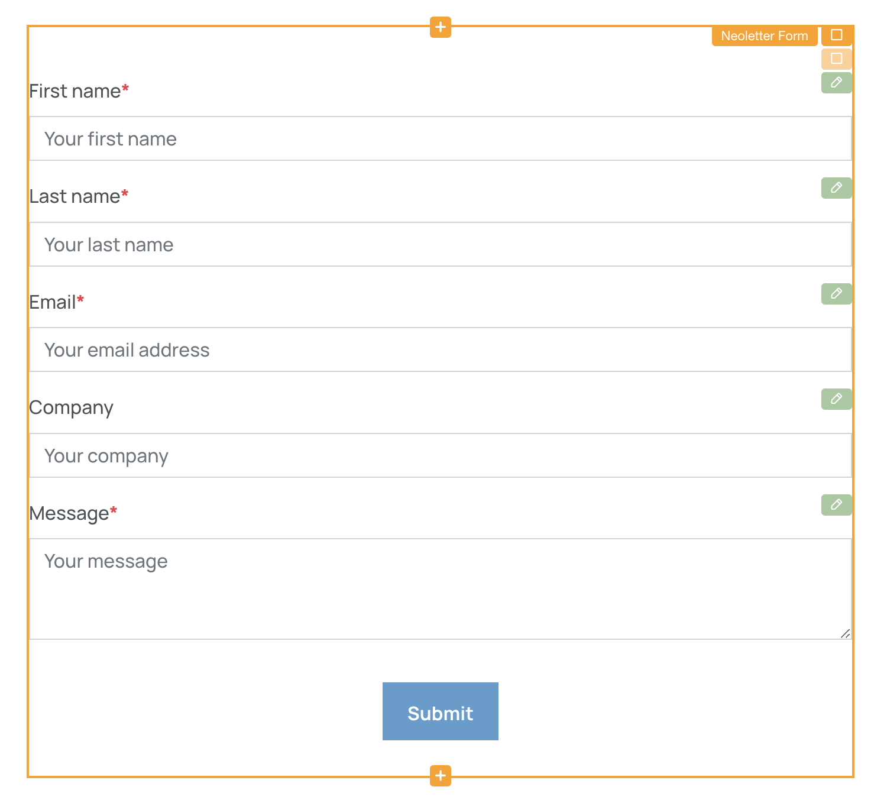
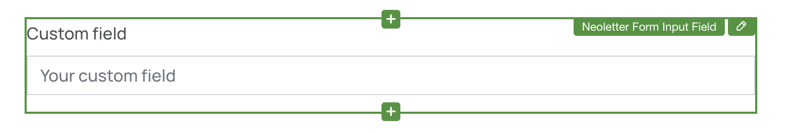

# Scrivito Form Widgets

A set of Scrivito Widgets for building awesome forms

# Features
- Single-step & multi-step forms
- Dropdowns
- Single-select radio buttons
- Multi-select checkboxes
- Rating controls
- Date & date-time controls
- Conditionals

## Installation

You need to remove any previously created forms and rebuild them after the installation. Copy the form IDs found in the FORM SUBMISSIONS tab inside the form properties before removing the forms.

Install the package into your scrivito app:

```shell
npm install scrivito-form-widgets
```

Import the `initScrivitoFormWidgets` function from the package, and call it in your index.js file found in the Widgets folder (e.g. in `src/Widgets/index.js`), passing your Scrivito tenant ID to the function:
```js
import { initScrivitoFormWidgets } from "scrivito-form-widgets";

initScrivitoFormWidgets(process.env.SCRIVITO_TENANT);
```


Add the widget styles to your app. 
This can be done by either loading the CSS via `css-loader` (e.g. in `src/index.js` or `src/Widgets/index.js`):

```js
import "scrivito-form-widgets/index.css";
```

 Or by importing the styles into your stylesheets (e.g. in `src/assets/stylesheets/index.scss`):

```scss
@import "~scrivito-form-widgets/index.css";
```

Delete all form widgets included in the Example App from the "Widgets" folder:
- FormButtonWidget
- FormCheckboxWidget
- FormContainerWidget
- FormHiddenFieldWidget
- FormInputFieldWidget

You're done! Enjoy building well-designed and cleverly arranged forms!

# Form Widgets Overview


The following widgets are typically added within the [Form](#form-widget) widget to create well-structured forms:

- [Form Step](#form-step-widget): Configures an individual step within a multi-step form.
- [Form Checkbox](#form-checkbox-widget): Adds checkbox input fields.
- [Form Date](#form-date-widget): Includes date and date-time input fields.
- [Form Input Field](#form-input-field-widget): Adds customizable input fields.
- [Form Rating](#form-rating-widget): Integrates a rating control.
- [Form Select](#form-select-widget):  Provides single or multiple selection options, including radio buttons, dropdowns, and checkboxes.
- [Hidden Form Field](#form-hidden-field-widget): Adds hidden form fields.
- [Form Conditional Container](#form-conditional-container-widget): Allows you to conditionally show/hide other widgets based on user selections.
- [Form Condition](#form-condition-widget): Defines a condition for showing or hiding other widgets within the [Form Conditional Container](#form-conditional-container-widget) widget.

Of course, you can also add any additional non-form widgets.

# Form Widgets

## Form Widget


The `Form` widget is the main widget for creating and managing forms. To add various form elements and controls, you need to place them inside the `Form` widget. 

### Properties


The `Form` widget has the following properties divided into several tabs:

- General tab
    - Format: Choose between "Single Step" and "Multiple Steps" form formats.
    - Show as Box: Set to display the form as a box.
    - Submitting Message: Message shown while the form is being submitted.
    - Submitted Message: Message shown after the form was successfully submitted.
    - Failed Message: Message shown if the form submission failed.
- Steps tab (Tab visible if Format is "Multiple Steps")
    - Steps: Configure form steps for multi-step forms.
- Hidden fields tab
    - Hidden Fields: Customize hidden fields.
- Form submission tab
    - Form ID: This ID identifies the form in Neoletter.
- Navigation area tab (Content depends on Format selection)
    - Forward Button Text: Text for the forward button.
    - Backward Button Text: Text for the backward button.
    - Submit Button Text: Text for the submit button.
    - Single Submit Button Alignment: Alignment for the single-step form submit button.

### Validation

The `Form` Widget has specific validation requirements:

- The widget should not be placed inside another form.
- For multi-step forms, you must include at least two steps.
- The form ID must be a 32-character hexadecimal value.

## Form Step Widget


The `Form Step` widget represents an individual step within a multi-step form. Each step can have its own set of form elements, controls, and content.

### Properties
- Items: Configure the items or content for this step.

### Validation
- The step widget should be placed within a Multiple Steps Form. 
- Each step must include at least one item. 

## Form Checkbox Widget


The `Form Checkbox` widget enables you to add single checkbox input fields to your form. You can specify whether the checkbox is mandatory and define its type, custom field name, and help text.

### Properties

- Input Type: Select the type of checkbox, such as accepting terms, subscriptions, or custom.
- Field Name: Define the field name for the checkbox.
- Label: Provide a descriptive label for the checkbox to convey its purpose.
- Mandatory: Indicates whether the checkbox is required.
- Help Text: Provide optional help text for the checkbox.

### Validation
- The field name must be unique and start with `custom_`, if the selected input type is `custom`.

## Form Date Widget


The `Form Date` widget allows users to input dates in various formats. You can customize the label, date format, field name, and specify whether the date input is mandatory.

### Properties

- Label: Set the label for the date input field.
- Format: Choose between date-only and date-and-time formats.
- Field Name: Define the field name for the date input.
- Mandatory: Indicates whether the date input is required.
- Help Text: Provide optional help text for the date input.

### Validation
- This date input widget should be placed within a Form widget to be effective.
- The field name must be unique and start with `custom_`.

## Form Input Field Widget


The `Form Input Field` widget adds customizable input fields to your form. You can define various properties such as label, placeholder, input type, custom type, custom field name, and help text.

### Properties

- Input Type: Select the type of input, such as name, email, phone number, or custom.
- Custom Input Type: Specify custom input types, such as single-line or multi-line.
- Field Name: Define the field name for the input.
- Label: Provide a descriptive label for the input field to convey its purpose.
- Placeholder: Define a placeholder text for the input field, providing guidance to users.
- Mandatory: Indicates whether the input field is required.
- Help Text: Provide optional help text for the input field.

### Validation
- This input field widget should be placed within a Form widget to be effective.
- The field name must be unique and start with `custom_`, if the selected input type is `custom`.

## Form Rating Widget


The `Form Rating` widget integrates a rating control into your form, allowing users to provide ratings for a particular item or experience.

### Properties

- Label: Set the label for the rating control.
- Field Name: Define the field name for the rating.
- Help Text: Provide optional help text for the rating control.

### Validation
- This rating widget should be placed within a Form widget to be effective.
- The field name must be unique and start with `custom_`.

## Form Select Widget


The `Form Select` widget enables you to create single or multiple selection elements, including radio buttons, dropdowns, or checkboxes in your form.

### Properties

- Input Type: Choose the type of input, which can be single select (radio buttons or dropdown) or multi-select (checkboxes).
- Label: Specify the label for the select input.
- Items: Configure the items or options available for selection.
- Field Name: Define the field name for the select input.
- Mandatory: Indicates whether selection is required for single select inputs (radio buttons and dropdowns).
- Help Text: Provide optional help text for the select input.

### Validation
- This select widget should be placed within a Form widget to be effective.
- The field name must be unique and start with `custom_`.


## Form Hidden Field Widget


The `Form Hidden Field` widget includes hidden form fields. These fields are typically used to store information that is sent on every submission of the form.

### Properties

- Field Name: Define the field name for the hidden field.
- Hidden Value: Specify the hidden value for this field.

### Validation
- This hidden field widget should be placed within a Form widget to be effective.
- The field name must be unique and start with `custom_`.

## Form Conditional Container Widget


The `Form Conditional Container` widget allows you to conditionally show or hide other widgets based on user selections. You can define conditions and provide content that appears based on the selected conditions. Furthermore, this widget enables you to create nested conditions by adding a Conditional Container widget within a Condition widget, allowing for intricate conditional logic.

### Properties

- Input Type: Choose the input type for conditional selection, such as radio buttons or dropdowns.
- Label: Set the label for the conditional container.
- Conditions: Define conditions that determine which content is shown.
- Field Name: Define the field name for the conditional container.
- Mandatory: Indicates whether the conditional container is required.
- Help Text: Provide optional help text for the conditional container.

### Validation
- This conditional container widget should be placed within a Form widget to be effective.
- The field name must be unique and start with `custom_`.

## Form Condition Widget

The `Form Condition` widget is used within the `Form Conditional Container` widget to define a single condition and specify the content to display when this condition is met.

### Properties

- Title: Set the title for the condition.
- Content: Configure the content to display when this condition is met. You can leave the content empty if you want no other widgets to be shown when this condition is met.

### Validation
- The Form Condition Widget should only be used within the Form Conditional Container Widget.
